# 🍽️ 飲食店予約サービス

## 📌 プロジェクト概要

このプロジェクトは、架空の飲食店向けに開発した予約管理システムです。主な目的は、業務の効率化と顧客サービスの向上です。

### 目指すもの
- **24時間予約可能**: ウェブを通じていつでも予約ができる環境を提供し、新規顧客の獲得を促進します。
- **管理の簡素化**: 電話予約とウェブ予約を一元管理することで、スタッフの負担を軽減します。
- **リピート促進**: マイページ機能を通じてクーポンを提供し、顧客の再来店を促します。

### 店舗設定
- **営業時間**: 16時～23時
- **席数**: 50席
- **現在の予約管理方法**: 紙ベースで電話受付のみ

### 課題
1. 電話予約のみで新規顧客を逃すリスクが高い。
2. 紙ベースの管理が非効率で、スタッフに負担がかかる。
3. リピート促進策が不足しており、既存顧客の再来店率が低い。

### 解決策
このシステムを導入することで、上記の課題を解決し、飲食店の運営をスムーズにすることが期待されます。

## 🖼️ 画面遷移

### ユーザー側の画面

ログイン

 
ユーザーも管理者もここからログインします。
  
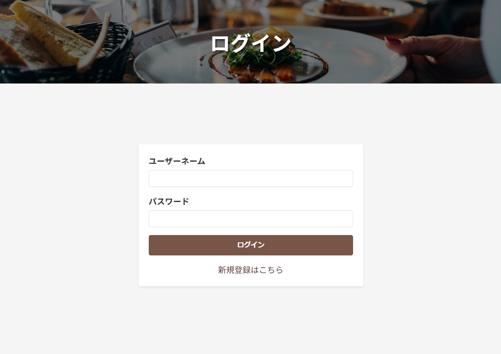

新規登録

 
こちらから会員登録をします。
  
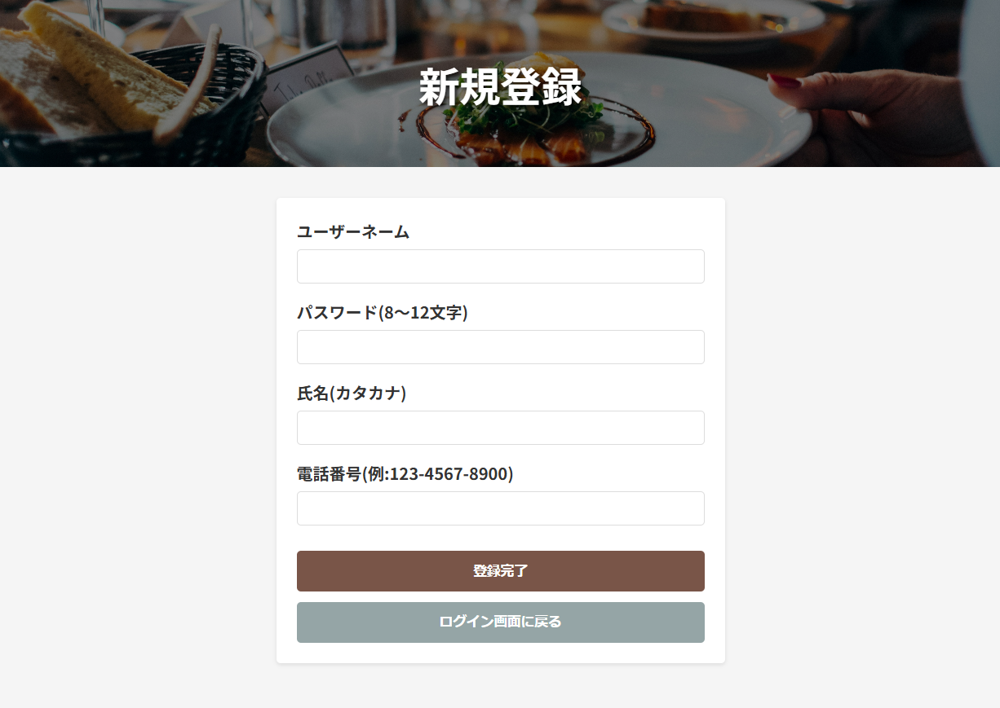

マイページ

 
ユーザーのホーム画面です。予約情報、ユーザー情報が確認できます。
  
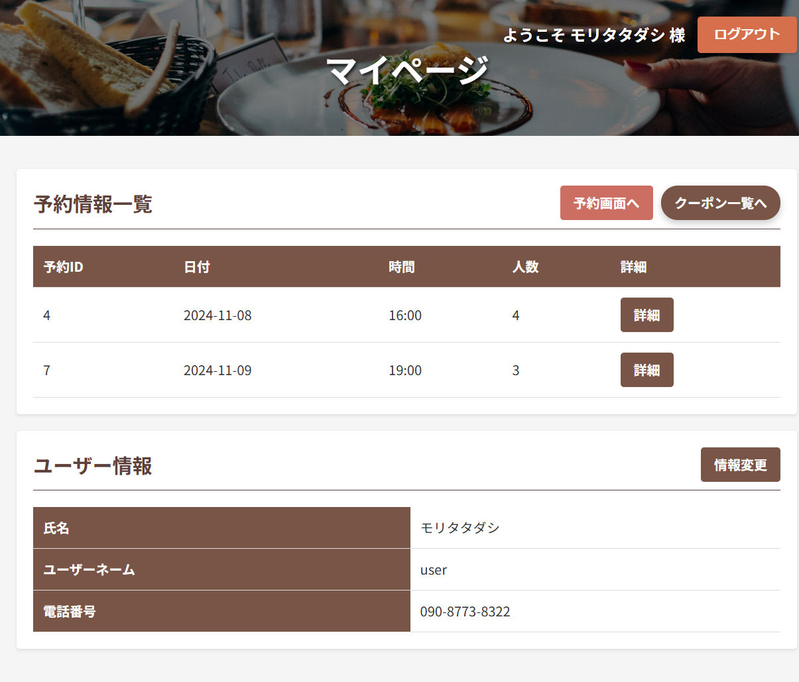

予約入力

 
ここから予約情報の入力をします。人数はカウント方式、予約日はカレンダー形式、予約時間は16時-23時のプルダウン方式です。
  
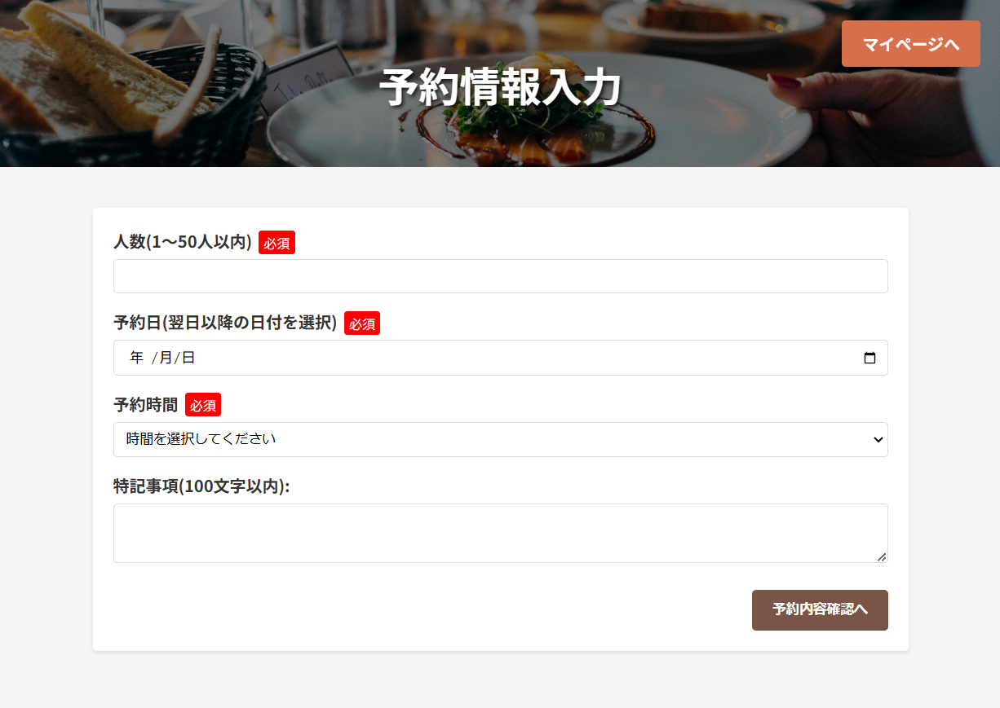

予約確認

 
先ほど入力した情報が表示されます。
  
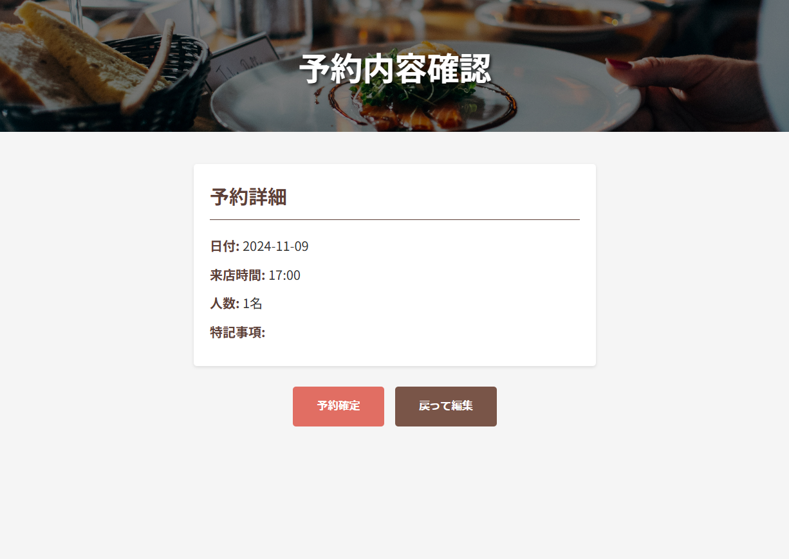

予約完了

 
ここでデータベースに予約情報が挿入されます。
  
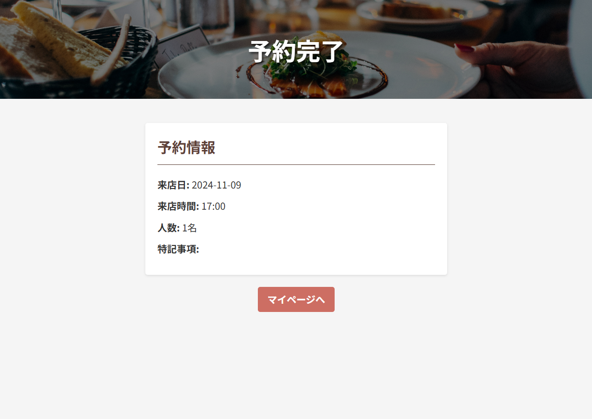

クーポン関連画面

 

クーポン一覧

 
獲得したクーポンが表示されます。クーポンの抽選は1日3回までに設定しています。
  
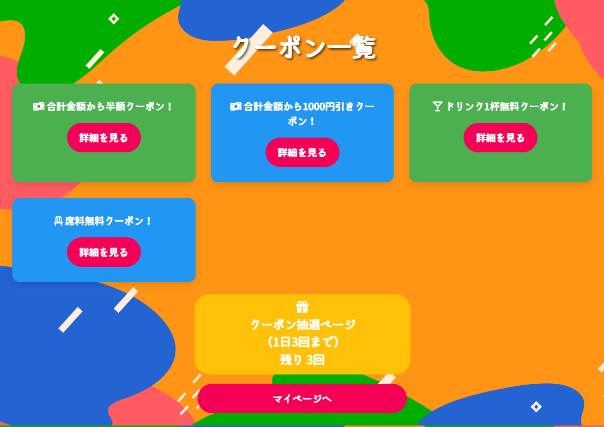

ルーレット

 
画面を開くとルーレットが回ります。回転に合わせてドラムロールがなるようになっています。またブラウザの戻るボタンを押しても不正利用ができないようになっています。
  
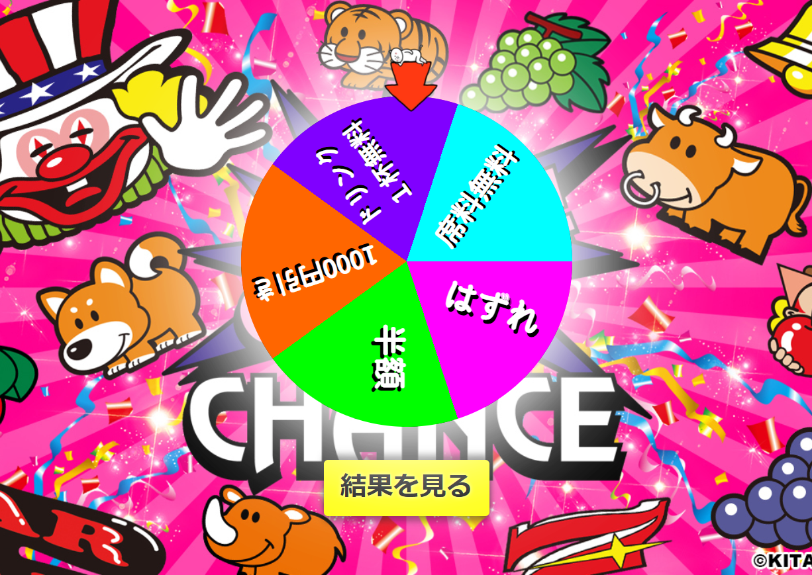

クーポン詳細

 
選択したクーポンの詳細を確認できます。有効期限は自動的に取得日から3か月後に設定されます。
  
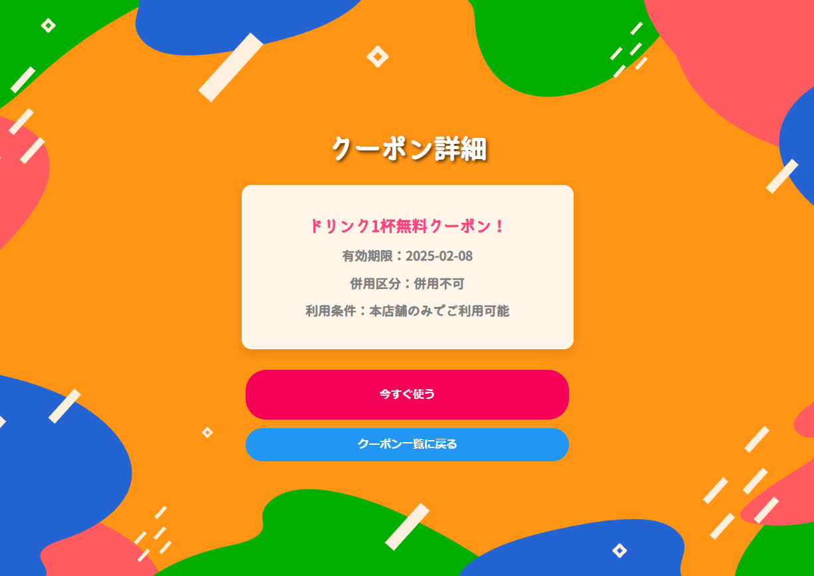

クーポン使用

 
詳細画面で「今すぐ使う」を押すとデータベースからクーポンが削除されます。バーコードが表示され店側で処理できるようになっています。
  
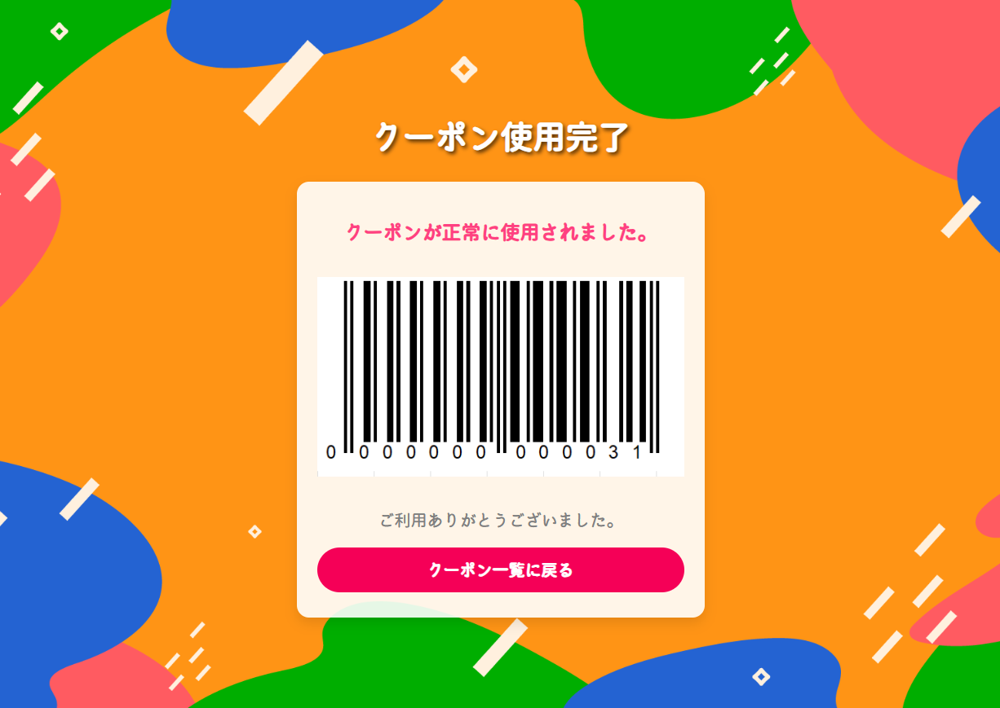

### 管理者側の画面

管理者メニュー

 
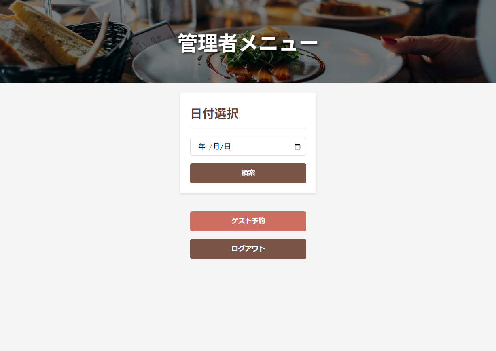

管理者予約確認

 
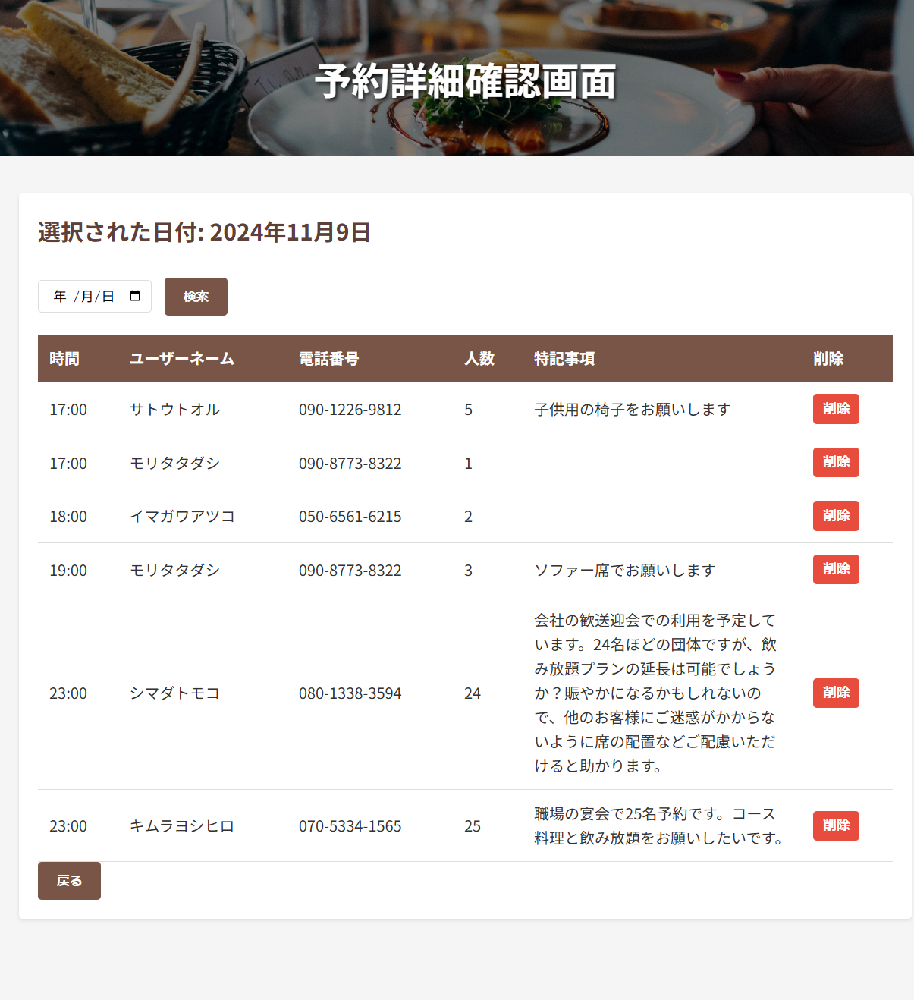

ゲストアカウント作成

 
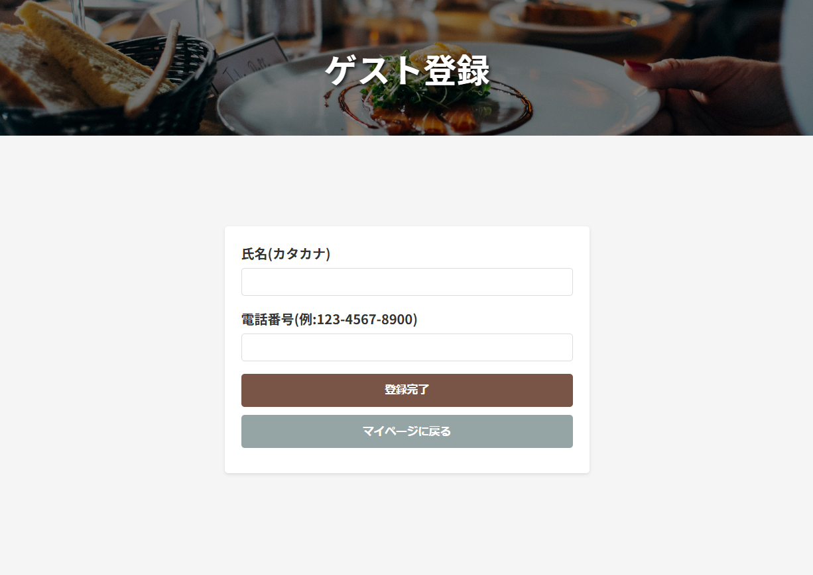

## 🛠️ 使用技術

- Java
- HTML
- CSS
- JavaScript
- Eclipse
- PostgreSQL
- Gradle

## 📚 ドキュメント

1. **要件定義書**:
   - システムが満たすべき要件や機能について詳細に記述しています。

2. **詳細設計書**:
   - システム構造や各コンポーネントの設計について詳しく説明しています。

3. **画面遷移図**:
   - ユーザーインターフェース内での画面間の遷移やフローを視覚的に表現しています。

4. **テーブル定義書**:
   - データベース内のテーブル構造や各カラムの詳細について記述しています。

5. **UIイメージ図**:
   - 各画面のデザインやレイアウトについて視覚的なイメージを提供しています。

6. **プレゼン資料**:
   - プロジェクト全体について説明するためのプレゼンテーション資料です。

## ✨ こだわりポイント

このプロジェクトでは、以下の点に特にこだわりました：

1. **ユーザーインターフェイス**:
   - シンプルで直感的なデザインを採用し、誰でも簡単に使えるようにしました。

2. **予約管理機能**:
   - 電話での予約も簡単に追加できる管理者機能を実装し、従業員がスムーズに業務を行えるよう配慮しました。

3. **クーポンシステム**:
   - JavaScriptを活用してクーポン獲得時のインタラクションを向上させ、不正利用防止策も講じています。

4. **会計との連携**:
   - バーコード機能を導入し、会計システムとの連携を強化しました。これにより、スムーズな会計処理が可能になります。

## 🚀 今後の計画

- 予約情報の編集機能の追加
- 以前の予約も確認できるようにする
- 管理者がクーポンの種類を追加できるようにする
- ユーザーの退会ページ作成
- 管理者権限のあるアカウントの追加機能
- パスワードを忘れた際の処理
